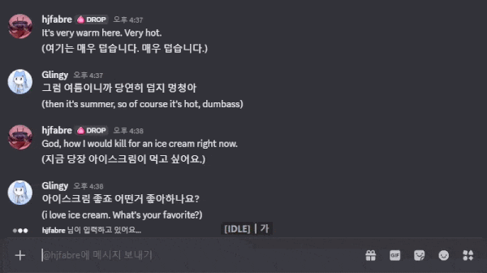
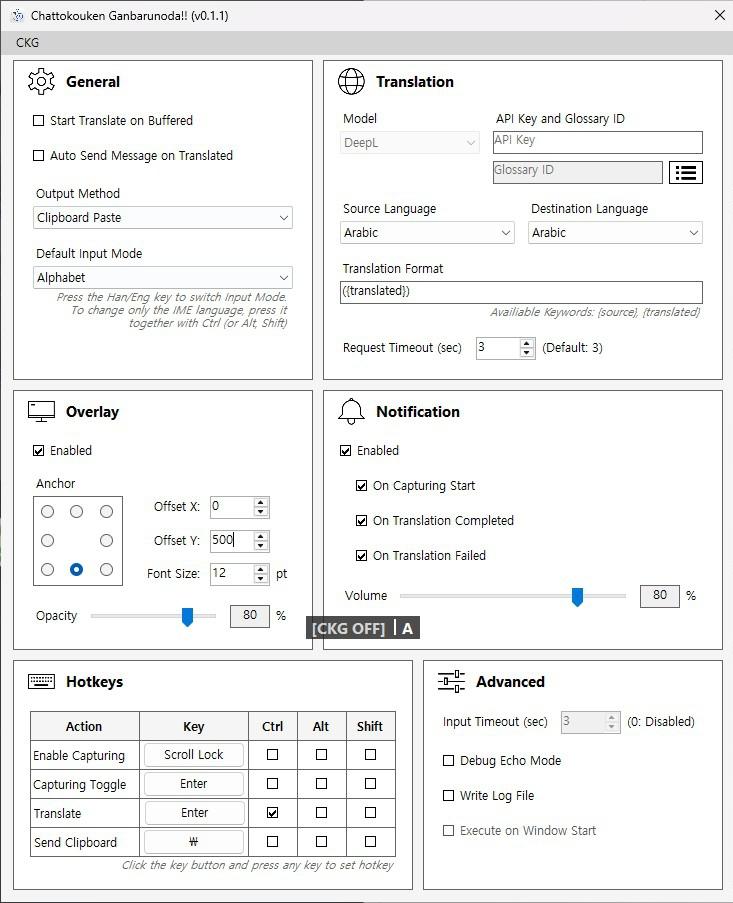

# Chattokouken Ganbarunoda!!


[English](README.md) | [한국어](README/README_KR.md) | [日本語](README/README_JP.md)

### Keep Up the Chat Contributions!!

> An automatic translation assistant tool that provides real-time chat translation and message forwarding! But It's not specifically intended for developers.

---

<br>

## Table of Contents!

- [Warnings and Limitations!](#warning)
- [Preview!](#preview)
- [What kind of program is this?](#about)
- [Installation and Usage!](#install)
- [How to Configure It!](#setting)
- [Changelog and Planned Updates!](#changelog)
- [You Can Support the Developer!](#support)
- [Frequently Asked Questions!](#faq)
- [Boring and Pedantic Technical Explanation](#description)

<br>
<a id="warning"></a>

## ⚠️ Warnings and Limitations!

> This program uses keyboard input hooks, process focus switching, and macro-like behavior, so it is not recommended to use it in games with strict anti-cheat or macro prevention systems! The developer cannot take responsibility for account suspensions or bans caused by using this program!

> Due to the current program structure, only English alphabets and Korean input are supported for typing right now... A different approach may be implemented in the future to support all languages, so please wait patiently! The translation target language itself does not matter!

<br>
<a id="preview"></a>

## 🎬 Preview!

> The person in the conversation is my friend. It is not being rude.




<br>
<a id="about"></a>

## ✨ What kind of program is this?

> When translation is needed while chatting in games or messengers, there is the extremely annoying process of >>typing a message, copying it, opening a web translator, translating it, copying the result again, going back, pasting it, and finally sending it<<... <br>This program exists to eliminate that inconvenience by automatically requesting translations according to the chat input cycle and automatically entering the translated text once it is received! Therefore: automatic! chat! translation! assistant! tool!

<br>

This program includes features such as:

- A composer that carefully assembles and stores typed characters
- DeepL integration that translates without complaining whenever requested
- Kindly copying translated text into the clipboard
- A macro that types clipboard contents for you
- An intuitive and trustworthy overlay that displays program status
- Beautiful notification sounds that loudly announce the current state
- A lightweight system tray application!

<br>

This program does not read or intercept chats from games or messengers. That would cause many problems. Instead, it simply reconstructs sentences by monitoring keyboard input separately.

<br>
<a id="install"></a>

## 📦 Installation and Usage!

> Only supported on Windows 11 64-bit environments! Windows 10 has not been tested.

<br>

Download the latest archive from [Releases](https://github.com/Railiya/ChattokoukenGanbarunoda/releases) and run CKG.exe. Administrator privileges are required!

<br>

The program lifecycle works like this:

1. **[DISABLED]** : Keyboard input capturing is disabled. It can be enabled or disabled again with the "Enable Capturing" key!
2. **[IDLE]** : Waiting state.
3. **[CAPTURING]** : Currently receiving input. Can be toggled with the "Capturing Toggle" key!
4. **[BUFFERED]** : Input is complete and the sentence has been stored.
5. **>> TRANSLATING** : Sending a translation request and waiting! Send the request using the "Translate" key!
6. **[READY]** : Translation is complete and copied to the clipboard! The input macro can be executed using the "Send Clipboard" key!
7. **[FAILED]** : Translation request failed... There can be many reasons, so check the log file.

<br>

Actual chat usage flow: (using default key bindings)

1. **Start Chat Input (Enter)** *[Idle -> Capturing]*
2. Type text
3. **Finish Chat Input (Enter)** *[Capturing -> Buffered]*
4. **Request Translation and Wait (Ctrl + Enter)** *[Buffered -> Translating]*
5. Translation completed *[Translating -> Ready]*
6. **Execute Input Macro (Backslash)**


<br>

**(Very Important Information!)**

This program maintains its Korean/English input mode separately from the Windows IME. Due to the program structure, it cannot determine the currently active language automatically. Therefore, **the program's Korean/English input mode must be switched manually. Pressing the Korean/English key normally will also synchronize the program's input mode with the Windows IME, but if the Korean/English key is pressed while holding Ctrl, Alt, or Shift, the program's input mode will NOT change.** Use this behavior to keep the chat input language and the program input language synchronized.

<br>

Steps 4 and 6 can also be automated through settings! If both options are enabled, you can simply chat without pressing additional keys! This workflow may take some practice, so enabling "Advanced - Debug Echo Mode" and practicing in Notepad is recommended!

<br>

When the X button is pressed, the program does not fully close and instead minimizes into the system tray. The program continues running. To completely exit the program, use "CKG -> Exit" from the top menu or right-click the tray icon and select "Exit".

<br>
<a id="setting"></a>

## ⚙️ How to Configure It!



### General

> Enabling all automatic options greatly improves UX, but if translation takes too long or times out, you will be unable to do anything during that time, so be careful!

| Setting | Description |
|---|---|
| Start Translate on Buffered | Automatically sends a translation request once input is completed and enters the buffered state |
| Auto Send Message on Translated | Automatically executes the input macro when translation is completed |
| Output Method | Determines how the input macro behaves |
| Default Input Mode | Initial Korean/English input mode of the program |

- Output Method - Clipboard Paste : Pastes clipboard contents directly
- Output Method - Input Simulating : Types clipboard contents character by character (useful for games where pasting is blocked)

<br>

### Translation

> To use translation, a DeepL API key is required! Other translation models are not supported yet. Glossaries are user-defined dictionaries used to prevent proper nouns and special terms from being translated incorrectly! The glossary ID is optional.

| Setting | Description |
|---|---|
| Model | Translation model to use |
| API Key | Authentication key required for the translator |
| Glossary Id | Glossary ID |
| Source Language | Input language |
| Destination Language | Target translation language |
| Translation Format | Format copied into the clipboard after translation |
| Request Timeout | Translation request timeout duration |

<br>

### Overlay

> Displays the current state of the program. Text colors also change depending on the state! The current input mode is displayed on the right side! 'A' means alphabet mode, and '가' means Korean mode!

| Setting | Description |
|---|---|
| Enabled | Enables or disables the overlay |
| Anchor | Screen anchor point for the overlay |
| Offset X,Y | Position offset from the anchor |
| Font Size | Font size |
| Opacity | Transparency |

<br>

### Notification

> Sound files are stored in the Sounds folder. They can be replaced as long as the filenames remain the same!

| Setting | Description |
|---|---|
| Enabled | Enables or disables sound notifications |
| On Capturing Start | Plays a sound when capturing begins |
| On Translation Completed | Plays a sound when translation finishes |
| On Translation Failed | Plays a sound when translation fails |
| Volume | Notification volume |

<br>

### Hotkeys

> To change a key, press the button until its text becomes "...", then press the desired key. Press ESC to cancel assignment. Since keys are distinguished by control modifiers, overlapping bindings are technically possible. However, when using the program in games, avoid conflicts with in-game controls.

| Setting | Description |
|---|---|
| Enable Capturing | Enables or disables keyboard capturing |
| Capturing Toggle | Starts or finishes input capturing (should match the chat hotkey in games) |
| Translate | Sends a translation request |
| Send Clipboard | Executes the clipboard input macro |

<br>

### Advanced

> Mostly used for debugging. Logs are saved inside the Logs folder.

| Setting | Description |
|---|---|
| Debug Echo Mode | Copies the original text into the clipboard instead of sending translation requests |
| Write Log File | Writes logs whenever the program state changes |

<br>
<a id="changelog"></a>

## 📄 Changelog and Planned Updates!

Please check [CHANGELOG.md](../CHANGELOG.md) for update history! Unfortunately, there is no Japanese version...

<br>

### Things that may or may not be added in the future!

> This project is updated personally during free time. Nothing can be guaranteed. Especially time.

<br>

**Overlay Input Method**

The current approach cannot properly handle complicated character systems such as Japanese or Chinese kanji. To solve this fundamental limitation, an overlay input field may be added in the future. When input begins, focus would be forcibly moved to the overlay, text would be entered through the Windows IME, and once input is completed, focus would return to the original process so the original message could be entered before continuing with translation requests and macro execution. However, this method has many limitations, so it would likely remain an optional fallback only for languages with difficult input systems.

<br>

**OCR Translation**

Planned separately from the original project goal. This could also serve as a fallback method when normal input does not work correctly. It also has the advantage of being able to translate messages written by other people.

<br>

**Input Macro Configuration**

Currently, the input macro is focused mainly on games, so it always behaves like "Enter -> Input -> Enter". In messengers, the input field is usually always active, so the first Enter is unnecessary. Additional settings may be added later to handle this more flexibly.

<br>

**Profile List**

A side menu profile list may be added so different settings can be saved for different games or messengers.

<br>

**More Translation APIs**

Google Translate API and Papago API are being considered. However, Papago only supports paid models, so honestly it may be difficult.

<br>

**Migration from WinForms to Avalonia**

WinForms only works on Windows... and honestly, it is not very pretty... Because of that, there is interest in eventually migrating to Avalonia, which could potentially support macOS and Linux while also looking much more modern. Of course, before that, it would first need to be verified whether keyboard hooks and other features work properly on other platforms.

<br>
<a id="support"></a>

## ☕ You Can Support the Developer!

> If you like this project, you can support the developer! It is not mandatory!

<br>

You can support the project through [Ko-fi](https://ko-fi.com/glingy) or [Sponsors](https://github.com/sponsors/Railiya)! It would be appreciated!

<br>
<a id="faq"></a>

## ❓ Frequently Asked Questions!

**Q. Why does this project talk like this?**

> **A. Because... it is funny.**

<br>

**Q. Can this capture mouse or arrow key related input?**

> **A. Since this program only receives keyboard input, mouse-related events cannot be processed. Arrow keys were intentionally omitted because they are not commonly used while chatting. Backspace already works properly, so this has not been a major issue in practice. However, if enough people request it, arrow key support may eventually be implemented.**

<br>

**Q. Why does the icon look like this?**

> **A. Please draw me a better icon...**

<br>
<a id="description"></a>

## 🛠️ Boring and Pedantic Technical Explanation

<br>

### How It Works

The program installs a global Windows keyboard hook and tracks keyboard input at a low level. Unfortunately, this input is received as physical keys rather than characters. For example, pressing the 'a' key could mean 'a', 'A', or even the Korean character 'ㅁ'. Because of this, the program implements a custom composer that reconstructs text differently depending on the current input mode. This is why Japanese kanji cannot currently be supported. The kanji candidate lists used during input vary depending on platform and user history, making them extremely difficult to track reliably.

Another issue is the inability to process mouse events. Since the system only receives keyboard input, there is no way to detect actions such as moving the cursor with the mouse or selecting kanji candidates with the mouse.

<br>

### Stability

As mentioned in the warning section above, this program behaves similarly to a macro, so using it in games with anti-cheat systems may be risky. The responsibility for using this program always belongs to the user. Just in case, here are the Win32 functions used by this program:

```cs
extern void keybd_event(byte bVk, byte bScan, uint dwFlags, nuint dwExtraInfo);
extern uint SendInput(uint nInputs, INPUT[] pInputs, int cbSize);
extern bool BlockInput(bool fBlockIt);

extern nint SetWindowsHookEx(int idHook, HookProc lpfn, nint hMod, uint dwThreadId);
extern bool UnhookWindowsHookEx(nint hhk);
extern nint CallNextHookEx(nint hhk, int nCode, nint wParam, nint lParam);
extern nint GetModuleHandle(string lpModuleName);

extern short GetKeyState(int nVirtKey);
extern short GetAsyncKeyState(int vKey);
extern bool GetKeyboardState(byte[] lpKeyState);
extern nint GetKeyboardLayout(uint idThread);
```
