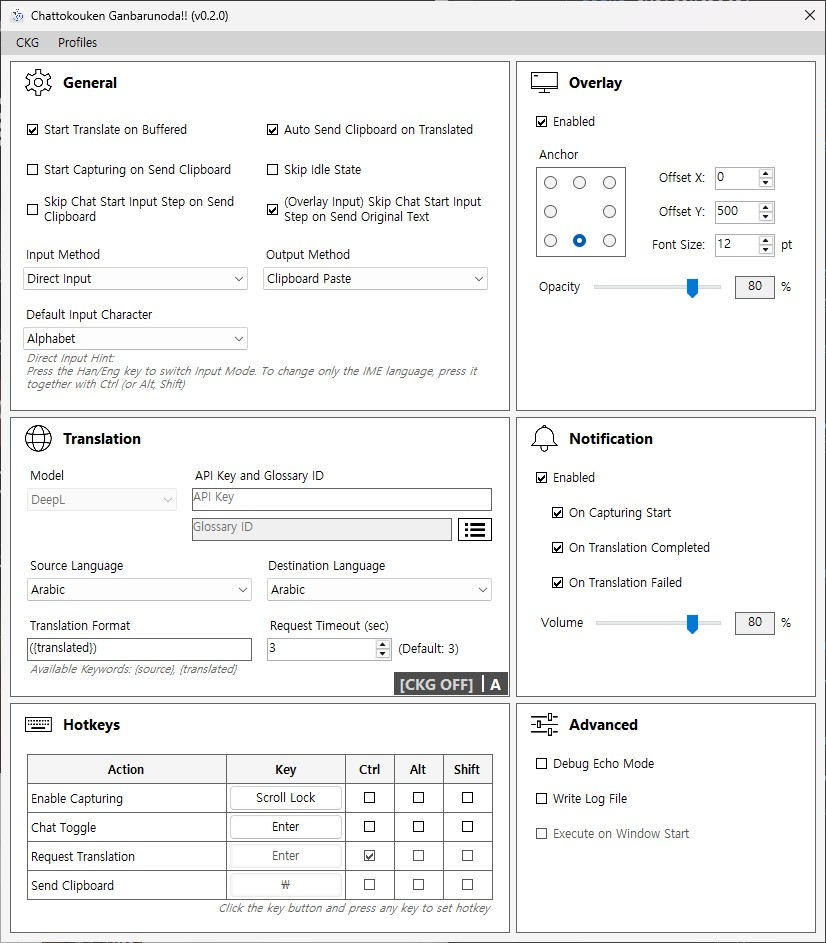

# Chattokouken Ganbarunoda!!


[English](README.md) | [한국어](README/README_KR.md) | [日本語](README/README_JP.md)

### Keep Up the Chat Contributions!!

> An automatic translation assistant tool that provides real-time chat translation and message forwarding! But It's not specifically intended for developers.

---

<br>

## Table of Contents!

- [Warnings and Limitations!](#warning)
- [Preview!](#preview)
- [What kind of program is this?](#about)
- [Installation and Usage!](#install)
- [How to Configure It!](#setting)
- [Config and Profiles!](#config)
- [Changelog and Planned Updates!](#changelog)
- [You Can Support the Developer!](#support)
- [Frequently Asked Questions!](#faq)
- [Boring and Pedantic Technical Explanation](#description)

<br>
<a id="warning"></a>

## ⚠️ Warnings and Limitations!

> This program uses keyboard input hooks, process focus switching, and macro-like behavior, so it is not recommended to use it in games with strict anti-cheat or macro prevention systems! The developer cannot take responsibility for account suspensions or bans caused by using this program!

<br>

**Supported languages!**

> This program has two input methods. Of those, Direct Input supports fewer languages. It may be a little inconvenient, but languages that do not support Direct Input should use Overlay Input. Overlay Input uses Windows IME, so there are no language restrictions.

- Direct Input supported languages: English, Korean
- Overlay Input: No restrictions (uses Windows IME)

<br>
<a id="preview"></a>

## 🎬 Preview!

> The person in the conversation is my friend. It is not being rude.


<br>
<a id="about"></a>

## ✨ What kind of program is this?

> When translation is needed while chatting in games or messengers, there is the extremely annoying process of >>typing a message, copying it, opening a web translator, translating it, copying the result again, going back, pasting it, and finally sending it<<... <br>This program exists to eliminate that inconvenience by automatically requesting translations according to the chat input cycle and automatically entering the translated text once it is received! Therefore: automatic! chat! translation! assistant! tool!

<br>

This program includes features such as:

- A composer that carefully assembles and stores typed characters
- DeepL integration that translates without complaining whenever requested
- Kindly copying translated text into the clipboard
- A macro that types clipboard contents for you
- An intuitive and trustworthy overlay that displays program status
- Beautiful notification sounds that loudly announce the current state
- A lightweight system tray application!

<br>

This program does not read or intercept chats from games or messengers. That would cause many problems. Instead, it reconstructs sentences by receiving keyboard input separately. Or it can receive input in the overlay's input field.

<br>
<a id="install"></a>

## 📦 Installation and Usage!

> Only supported on Windows 11 64-bit environments! Windows 10 has not been tested.

<br>

Download the latest archive from [Releases](https://github.com/Railiya/ChattokoukenGanbarunoda/releases) and run CKG.exe. Administrator privileges are required!

<br>

**The program lifecycle works like this:**

1. **[DISABLED]** : Keyboard input capturing is disabled. It can be enabled or disabled again with the "Enable Capturing" key!
2. **[IDLE]** : Waiting state.
3. **[CAPTURING]** : Currently receiving input. Can be toggled with the "Chat Toggle" key!
4. **[BUFFERED]** : Input is complete and the sentence has been stored.
5. **>> TRANSLATING** : Sending a translation request and waiting! Send the request using the "Request Translation" key!
6. **[READY]** : Translation is complete and copied to the clipboard! The input macro can be executed using the "Send Clipboard" key!
7. **[FAILED]** : Translation request failed... There can be many reasons, so check the log file.

> You can see the current state by enabling the overlay!

<br>

**Actual chat usage flow: (using default key bindings)**

1. **Start Chat Input (Enter)** *[Idle -> Capturing]*
2. Type text
3. **Finish Chat Input (Enter)** *[Capturing -> Buffered]*
4. **Request Translation and Wait (Ctrl + Enter)** *[Buffered -> Translating]*
5. Translation completed *[Translating -> Ready]*
6. **Execute Input Macro (Backslash)**

> Steps 4 and 6 can be automated through settings! If both options are enabled, you can simply chat without pressing extra keys! This workflow may take some practice, so enabling "Advanced - Debug Echo Mode" and practicing in Notepad is recommended!

<br>

**Direct Input Hint:**

> This program maintains its Korean/English input mode separately from the Windows IME. Due to the program structure, it cannot determine the currently active language automatically. Therefore, **the program's Korean/English input mode must be switched manually. Pressing the Korean/English key normally will also synchronize the program's input mode with the Windows IME, but if the Korean/English key is pressed while holding Ctrl, Alt, or Shift, the program's input mode will NOT change.** Use this behavior to keep the chat input language and the program input language synchronized.

Direct Input is used directly in the chat of games or messengers! While typing into chat as usual, the program collects keyboard input, composes it, and translates that text. Because of that, the text you actually typed and the text composed by the program can differ. A common example is the Korean/English input state and moving the cursor with the mouse.

<br>

**Overlay Input Hint:**

Overlay Input requires focus switching between the game or messenger and the program! Because you type chat text in the program's input field, it is fine for messengers, but depending on the game it can be inconvenient. When you start typing, focus moves to the program, and when input is finished, focus returns to the game or messenger so it can send the original text first and then the translated text afterward. Since there is a small delay during focus switching, it is a little slower than Direct Input.

If you are going to use it in a game, check the following:

- The game must not be in Fullscreen. It should be Windowed or Borderless. In Fullscreen mode, focus switching can cause the game to minimize.
- Some games mute audio or switch to a minimum frame rate when they lose focus.

<br>

**System tray related:**

When the X button is pressed, the program does not fully close and instead minimizes into the system tray. The program continues running. To completely exit the program, use "CKG -> Exit" from the top menu or right-click the tray icon and select "Exit".

<br>
<a id="setting"></a>

## ⚙️ How to Configure It!



<br>

### General

> Enabling all automatic options greatly improves UX, but if translation takes too long or times out, you will be unable to do anything during that time, so be careful!

| Setting | Description |
|---|---|
| Start Translate on Buffered | Automatically sends a translation request once input is completed and enters the buffered state |
| Auto Send Clipboard on Translated | Automatically executes the input macro when translation is completed |
| Start Capturing on Send Clipboard | Once send clipboard is completed, it automatically switches to the capturing state for the next text Input |
| Skip Idle State | Skip idle state and it automatically switches to capturing state |
| Skip Chat Start Input Step on Send Clipboard | Skips the chat start input step during the send clipboard process |
| (Overlay Input) Skip Chat Start Input Step on Send Original Text | Skips the chat start input step when sending the Ooiginal text while using overlay input |
| Input Method | Method of entering the original chat text |
| Output Method | Determines how the input macro behaves |
| Default Input Character | Initial Korean/English input character mode of the program |

- Input Method - Direct Input : Types directly into the chat window of a game or messenger. Text is composed by pressing keys.
- Input Method - Overlay Input : Types into the program's input field. This is used for languages that do not support Direct Input.
- Output Method - Clipboard Paste : Pastes clipboard contents directly
- Output Method - Input Simulating : Types clipboard contents character by character (useful for games where pasting is blocked)

<br>

**Recommended Settings!**

- Games : Start Translate on Buffered, Auto Send Message on Translated, Skip Chat Start Input on Original Message Sending

> Since games usually follow the flow of activate chat -> type message -> close chat, it is recommended NOT to skip the chat input step itself. If waiting for translation feels annoying, it is recommended to disable only "Auto Send Message on Translated".

- Messengers : Everything!

> Messengers usually do not have any disadvantage while waiting for translation. Therefore, fully automating everything is recommended! Since chat input is usually always active in messengers, enabling automatic capturing state switching helps keep input uninterrupted. If something seems to malfunction, it is recommended to disable only "Skip Chat Start Input on Clipboard Sending".

<br>

### Overlay

> Displays the current state of the program. The text color also changes depending on the state! The current input mode is shown on the right side! 'A' means alphabet mode, and '가' means Korean mode! If Overlay Input is used, the language mode is not shown.

| Setting | Description |
|---|---|
| Enabled | Enables or disables the overlay |
| Anchor | Screen anchor point for the overlay |
| Offset X,Y | Position offset from the anchor |
| Font Size | Font size |
| Opacity | Transparency |

<br>

### Translation

> To use translation, a DeepL API key is required! Other translation models are not supported yet. Glossaries are user-defined dictionaries used to prevent proper nouns and special terms from being translated incorrectly! The glossary ID is optional.

| Setting | Description |
|---|---|
| Model | Translation model to use |
| API Key | Authentication key required for the translator |
| Glossary Id | Glossary ID |
| Source Language | Input language |
| Destination Language | Target translation language |
| Translation Format | Format copied into the clipboard after translation |
| Request Timeout | Translation request timeout duration |

<br>

### Notification

> Sound files are stored in the Sounds folder. They can be replaced as long as the filenames remain the same!

| Setting | Description |
|---|---|
| Enabled | Enables or disables sound notifications |
| On Capturing Start | Plays a sound when capturing begins |
| On Translation Completed | Plays a sound when translation finishes |
| On Translation Failed | Plays a sound when translation fails |
| Volume | Notification volume |

<br>

### Hotkeys

> To change a key, press the button until its text becomes "...", then press the desired key. Press ESC to cancel assignment. Since keys are distinguished by control modifiers, overlapping bindings are technically possible. However, when using the program in games, avoid conflicts with in-game controls.

| Setting | Description |
|---|---|
| Enable Capturing | Enables or disables keyboard capturing |
| Chat Toggle | Starts or finishes input capturing (should match the chat hotkey in games) |
| Request Translation | Sends a translation request |
| Send Clipboard | Executes the clipboard input macro |

<br>

### Advanced

> Mostly used for debugging. Logs are saved inside the Logs folder.

| Setting | Description |
|---|---|
| Debug Echo Mode | Copies the original text into the clipboard instead of sending translation requests |
| Write Log File | Writes logs whenever the program state changes |

<br>
<a id="config"></a>

## ⚙️ Config and Profiles!

<br>

**Config file**

> Separate from profiles, this is the file that configures the program's environment. When the program is launched for the first time, a "config.json" file is created.

You can open and edit the config file directly! If you want to use a different interface language, edit the file. If the language is not supported, English is used by default.

<br>

**Profiles**

> A profile is a file that stores the settings shown when the program is running. Changes are saved automatically.

You can create and use multiple profiles. Right now this is a temporary feature, so you need to create the files manually. In the folder where the executable is located, go into the "Profiles" folder, copy the "profile1.ckgprofile" file, rename it to something like "profile2", "profile3", or "profile4", and then open it and change "ProfileName". You can load it from the top menu of the program.

<br>
<a id="changelog"></a>

## 📄 Changelog and Planned Updates!

Please check [CHANGELOG.md](CHANGELOG.md) for update history! Unfortunately, there is no Japanese version...

<br>

### Things that may or may not be added in the future!

> This project is updated personally during free time. Nothing can be guaranteed. Especially time.

<br>

**OCR Translation**

Planned separately from the original project goal. This could also serve as a fallback method when normal input does not work correctly. It also has the advantage of being able to translate messages written by other people.

<br>

**Input Macro Configuration**

Currently, the input macro is focused mainly on games, so it always behaves like "Enter -> Input -> Enter". In messengers, the input field is usually always active, so the first Enter is unnecessary. Additional settings may be added later to handle this more flexibly.

<br>

**Profile List (Real)**

Unlike the temporary profile feature that exists now, a profile list will be added as a side menu on the left.

<br>

**More Translation APIs**

Google Translate API and Papago API are being considered. However, Papago only supports paid models, so honestly it may be difficult.

<br>

**Migration from WinForms to Avalonia**

WinForms only works on Windows... and honestly, it is not very pretty... Because of that, there is interest in eventually migrating to Avalonia, which could potentially support macOS and Linux while also looking much more modern. Of course, before that, it would first need to be verified whether keyboard hooks and other features work properly on other platforms.

<br>
<a id="support"></a>

## ☕ You Can Support the Developer!

> If you like this project, you can support the developer! It is not mandatory!

<br>

You can support the project through [Ko-fi](https://ko-fi.com/glingy) or [Sponsors](https://github.com/sponsors/Railiya)! It would be appreciated!

<br>
<a id="faq"></a>

## ❓ Frequently Asked Questions!

**Q. Why does this project talk like this?**

> **A. Because... it is funny.**

<br>

**Q. Can this capture mouse or arrow key related input?**

> **A. Since this program only receives keyboard input, mouse-related events cannot be processed. Arrow keys were intentionally omitted because they are not commonly used while chatting. Backspace already works properly, so this has not been a major issue in practice. However, if enough people request it, arrow key support may eventually be implemented.**

<br>

**Q. Why does the icon look like this?**

> **A. Please draw me a better icon...**

<br>
<a id="description"></a>

## 🛠️ Boring and Pedantic Technical Explanation

<br>

**How It Works - Direct Input**

The program installs a hook on keyboard input used globally throughout Windows and tracks key presses at a low level. Unfortunately, this input is received as keys rather than characters. So if you press the 'a' key, it could mean 'a', 'A', or even 'ㅁ'. Because of that, the program reconstructs sentences by implementing a composer that combines alphabets or Korean characters according to the current input mode. This is why Japanese kanji cannot be supported. The set of kanji used for input differs by platform and by how each user commonly types, so there is no reliable way to track it.

Another issue is the inability to process mouse events. Since the system only receives keyboard input, there is no way to detect actions such as moving the cursor with the mouse or selecting kanji candidates with the mouse.

<br>

**How It Works - Overlay Input**

Direct Input has a limitation: it cannot be used unless a composer is implemented. Even so, because the program needs to support languages around the world, Overlay Input was proposed as a fundamentally different approach. When chat input begins, focus moves from the game or messenger to this program, the overlay input field is activated, and the text is entered there. When input ends, focus moves back to the original program, the saved original text is sent first, and then the translated text is sent in the same way as Direct Input. Because the input field uses Windows IME, it can be used without language restrictions. Even so, there are still some inconveniences because focus must be moved, such as not being able to use Fullscreen mode and concerns about stability.

<br>

**Stability**

As mentioned in the warning section above, this program behaves similarly to a macro, so using it in games with anti-cheat systems may be risky. The responsibility for using this program always belongs to the user. Just in case, here are the Win32 functions used by this program:

```cs
/* user32.dll */

//KeyInputObserver.cs
extern nint SetWindowsHookEx(int idHook, HookProc lpfn, nint hMod, uint dwThreadId);
extern bool UnhookWindowsHookEx(nint hhk);
extern nint CallNextHookEx(nint hhk, int nCode, nint wParam, nint lParam);

//KeyMacroHandler.cs
extern void keybd_event(byte bVk, byte bScan, uint dwFlags, nuint dwExtraInfo);
extern uint SendInput(uint nInputs, INPUT[] pInputs, int cbSize);
extern bool BlockInput(bool fBlockIt);

//CapturingHandler.cs
extern short GetKeyState(int nVirtKey);
extern short GetAsyncKeyState(int vKey);
extern bool GetKeyboardState(byte[] lpKeyState);
extern nint GetKeyboardLayout(uint idThread);

//CapturingHandler.cs (Used For Overlay Input)
extern IntPtr GetForegroundWindow();
extern bool SetForegroundWindow(IntPtr hWnd);
extern bool AllowSetForegroundWindow(uint dwProcessId);
extern bool AttachThreadInput(uint idAttach, uint idAttachTo, bool fAttach);
extern uint GetWindowThreadProcessId(IntPtr hWnd, out uint lpdwProcessId);

//OverlayForm.cs (Used For Overlay Input)
extern int GetWindowLong(IntPtr hWnd, int nIndex);
extern int SetWindowLong(IntPtr hWnd, int nIndex, int dwNewLong);

/* kernel32.dll */

//KeyInputObserver.cs
extern nint GetModuleHandle(string lpModuleName);

//CapturingHandler.cs (Used For Overlay Input)
extern uint GetCurrentThreadId();
```
