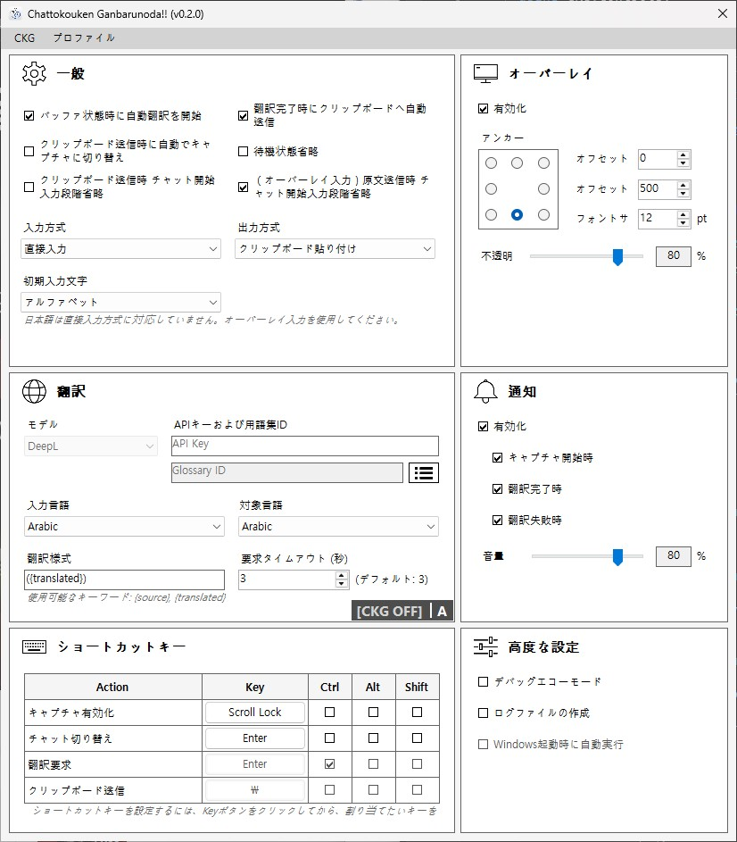

# Chattokouken Ganbarunoda!!


[English](../README.md) | [한국어](README_KR.md) | [日本語](README_JP.md)

### チャット貢献頑張るのだ！！

> リアルタイムチャット翻訳とメッセージ送信をしてくれる自動翻訳補助ツールなのだ！ 特に開発者向けの用途というわけではないのだ。

---

<br>

## 目次なのだ！

- [注意事項と制限なのだ！](#warning)
- [プレビューなのだ！](#preview)
- [どんなプログラムなのだ？](#about)
- [インストールと使い方なのだ！](#install)
- [設定方法なのだ！](#setting)
- [コンフィクとプロフィールなのだ！](#config)
- [更新内容と今後の予定なのだ！](#changelog)
- [開発者を支援できるのだ！](#support)
- [よくある質問なのだ！](#faq)
- [退屈で衒学的な技術説明](#description)

<br>
<a id="warning"></a>

## ⚠️ 注意事項と制限なのだ！

> このプログラムはキーボードフック、フォーカス移動、マクロのような入力処理を使用しているのだ。だから厳しいアンチチートやマクロ防止機能があるゲームでは使用をおすすめしないのだ！このプログラムの使用によるアカウント停止やBANについて、開発者は責任を取れないのだ！

<br>

**対応言語一覧なのだ:**

> このプログラムには2種類の入力方式があるのだ。そのうち直接入力方式は対応できる言語が少ないのだ。少し不便かもしれないが、直接入力に対応していない言語ではオーバーレイ入力を使う必要があるのだ。オーバーレイ入力はWindows IMEを使うので、言語制限はないのだ。

- 直接入力対応言語：英語、韓国語
- オーバーレイ入力：制限なし（Windows IME使用）

<br>
<a id="preview"></a>

## 🎬 プレビューなのだ！

> 会話相手は友達なのだ。別に失礼ではないのだ。


<br>
<a id="about"></a>

## ✨ どんなプログラムなのだ？

> ゲームやメッセンジャーで翻訳しながらチャットしたい時、>>文章を入力してコピーしてWeb翻訳を開いて翻訳して、またコピーして戻って貼り付けて送信する<<という、とんでもなく面倒な流れがあるのだ... <br>このプログラムは、その不便さをなくすために、チャット入力の流れに合わせて自動で翻訳をリクエストし、翻訳結果を受け取ったら自動で入力してくれる補助ツールなのだ！つまり、自動！チャット！翻訳！補助！ツール！なのだ！

<br>

このプログラムには、こんな機能があるのだ：

- 入力された文字を頑張って組み立てて保存してくれるコンポーザー
- 頼めば黙々と翻訳してくれるDeepL連携
- 翻訳結果をクリップボードへ入れてくれる親切機能
- 代わりにクリップボード内容を入力してくれるマクロ
- 現在状態を表示してくれる頼もしいオーバーレイ
- 状態を知らせてくれる綺麗な通知サウンド
- 軽量なシステムトレイアプリなのだ！

<br>

このプログラムはゲームやメッセンジャーのチャットを読み取ったり横取りしたりするものではないのだ。それは問題がとても多いのだ。それとは別に、キー入力を受け取って文章を組み立てるのだ。あるいはオーバーレイの入力フィールドに入力するのだ。

<br>
<a id="install"></a>

## 📦 インストールと使い方なのだ！

> Windows 11 64bit環境のみ対応なのだ！Windows 10ではまだテストしていないのだ。

<br>

[Releases](https://github.com/Railiya/ChattokoukenGanbarunoda/releases) から最新の圧縮ファイルをダウンロードして、CKG.exe を実行するのだ。管理者権限が必要なのだ！

<br>

**プログラムのライフサイクルは次のとおりなのだ:**

1. **[DISABLED]** : キー入力取得が無効状態なのだ。「キャプチャ有効化」キーでON/OFFできるのだ！
2. **[IDLE]** : 待機状態なのだ。
3. **[CAPTURING]** : 入力を受け取っている状態なのだ。「チャット切り替え」キーで切り替えるのだ！
4. **[BUFFERED]** : 入力完了後、文章が保存された状態なのだ。
5. **>> TRANSLATING** : 翻訳リクエストを送って待機中なのだ！「翻訳要求」キーでリクエストするのだ！
6. **[READY]** : 翻訳完了してクリップボードへコピーされた状態なのだ！「クリップボード送信」キーで入力マクロを実行できるのだ！
7. **[FAILED]** : 翻訳リクエスト失敗なのだ... 原因はいろいろあるのでログファイルを見るのだ。

> オーバーレイを有効化すると現在の状態を確認できるのだ！

<br>

**実際のチャット手順はこんな感じなのだ：（デフォルトキー基準なのだ）**

1. **チャット入力開始 (Enter)** *[Idle -> Capturing]*
2. テキスト入力
3. **チャット入力終了 (Enter)** *[Capturing -> Buffered]*
4. **翻訳リクエスト送信と待機 (Ctrl + Enter)** *[Buffered -> Translating]*
5. 翻訳完了 *[Translating -> Ready]*
6. **入力マクロ実行 (Backslash)**

> 4番と6番の処理はオプションを設定すると自動化できるのだ！両方をONにすれば、ほかのキーを押さずにそのままチャットするだけでよくなるのだ！この流れにはある程度慣れが必要なので、「高度設定 - デバッグエコーモード」をONにしてメモ帳で練習するのがおすすめなのだ！

<br>

**直接入力ヒントなのだ:**

> このプログラムでは、韓国語/英語入力状態をWindows IMEとは別に管理しているのだ。プログラム構造上、現在どの入力言語なのかを完全には把握できないのだ。だから**プログラム内の韓国語/英語入力モードは手動で切り替える必要があるのだ。韓英キーを普通に押すとWindows IMEと一緒にプログラム側の入力モードも切り替わるのだが、Ctrl、Alt、Shiftのどれかを押したまま韓英キーを押すと、プログラム側の入力モードは切り替わらないのだ。** この挙動を利用して、チャット入力言語とプログラム入力言語を合わせて使うのだ！

直接入力はゲームやメッセンジャーのチャットをそのまま使う方式なのだ！チャットはチャットのまま入力しつつ、プログラムがキー入力を拾って組み立て、その内容を翻訳するのだ。だから、実際に入力した内容とプログラムが組み立てた内容が違うことがあるのだ。代表的な例は韓英状態と、マウスによるカーソル移動なのだ。

<br>

**オーバーレイ入力ヒントなのだ:**

オーバーレイ入力では、ゲームやメッセンジャーとプログラムの間でフォーカス移動が必要なのだ！プログラムの入力フィールドでチャットを入力するので、メッセンジャーなら問題ないが、ゲームによっては不便かもしれないのだ。チャットを入力するときはプログラムへフォーカスが移り、入力が終わったら再びゲームやメッセンジャーへ戻って、まず原文を送信し、そのあと翻訳文を送信するのだ。フォーカス移動の間には少し遅延があるので、直接入力より少し遅いのだ。

ゲームで使うなら次を確認しておくのだ：

- ゲームが全画面（Fullscreen）ではダメなのだ。ウィンドウモード（Windowed）かボーダーレス（Borderless）でなければいけないのだ。全画面ではフォーカス移動時に最小化される問題があるのだ。
- ゲームによっては、フォーカスを失うとミュートになったり、最低フレームに設定されたりする場合があるのだ。

<br>

**システムトレイ関連なのだ:**

Xボタンを押してもプログラムは完全終了せず、システムトレイへ移動するのだ。つまり裏で動き続けているのだ。完全終了するには、上部メニューの「CKG -> Exit」を押すか、トレイアイコンを右クリックして「Exit」を押すのだ。

<br>
<a id="setting"></a>

## ⚙️ 設定方法なのだ！



<br>

### 一般 (General)

> 自動オプションを全部ONにするとUXはかなり良くなるのだが、翻訳が長引いたりタイムアウトすると、その間は何もできなくなるので注意なのだ！

| Setting | Description |
|---|---|
| バッファ状態時に自動翻訳を開始 | 入力完了後、Buffer状態になると自動で翻訳リクエストを送るのだ |
| 翻訳完了時にクリップボードへ自動送信 | 翻訳完了時、自動で入力マクロを実行するのだ |
| クリップボード送信時に自動でキャプチャに切り替え | クリップボード送信が完了すると、次のテキスト入力のために自動でキャプチャ状態に切り替わるのだ |
| 待機状態省略 | 待機状態を省略し、自動でキャプチャ状態に切り替わるのだ |
| クリップボード送信時 チャット開始入力段階省略 | クリップボード送信の処理中、チャット開始の入力段階を省略するのだ |
| （オーバーレイ入力）原文送信時 チャット開始入力段階省略 | オーバーレイ入力の使用中、原文を送信する際のチャット開始の入力段階を省略するのだ |
| 入力方式 | チャット原文の入力方式なのだ |
| 出力方式 | 入力マクロの動作方式なのだ |
| 初期入力文字 | プログラム起動時の韓英入力状態なのだ |

- 入力方式 - 直接入力 : ゲームやメッセンジャーのチャットに直接入力するのだ。キー入力によって文字を組み合わせるのだ。ただし、日本語は直接入力に対応していないのだ。
- 入力方式 - オーバーレイ入力 : プログラムの入力フィールドに入力するのだ。直接入力に対応していない言語の場合に使うのだ。
- 出力方式 - クリップボード貼り付け : クリップボード内容を貼り付ける方式なのだ。
- 出力方式 - 入力シミュレーション : クリップボード内容を1文字ずつ入力する方式なのだ。（貼り付け禁止ゲーム向けなのだ）

<br>

**おすすめ設定なのだ！**

- ゲーム : バッファ状態時に自動翻訳を開始、翻訳完了時にクリップボードへ自動送信、原文送信時にチャット開始入力段階を省略

> ゲームでは「チャット開始 -> 入力 -> チャット終了」の流れになることが多いので、入力開始段階は省略せず使うのがおすすめなのだ。翻訳待ちが嫌なら、「翻訳完了時にクリップボードへ自動送信」だけOFFにするのがおすすめなのだ。

- メッセンジャー : 全部なのだ！

> メッセンジャーでは翻訳待ちによる不都合がほとんど無いのだ。だから全部自動化するのだ！メッセンジャーでは常にチャット入力が有効になっていることが多いので、入力が途切れないよう自動キャプチャ状態切り替えをONにしておくのがおすすめなのだ。もし何か誤作動しているようなら、「クリップボード送信時にチャット開始入力段階を省略」だけOFFにするのがおすすめなのだ。

<br>

### オーバーレイ (Overlay)

> プログラムの現在状態が見えるのだ。状態によって文字色も変わるのだ！右側にはプログラムの入力モードが表示されるのだ！アルファベットなら「A」、韓国語なら「가」と表示されるのだ！オーバーレイ入力を使うと、言語モードは表示されないのだ。

| Setting | Description |
|---|---|
| 有効化 | オーバーレイをON/OFFするのだ |
| アンカー | オーバーレイ表示基準位置なのだ |
| オフセット X,Y | 基準位置からのオフセットなのだ |
| フォントサイズ | フォントサイズなのだ |
| 不透明度 | 透明度なのだ |

<br>

### 翻訳 (Translation)

> 翻訳を使うにはDeepL APIキーが必要なのだ！まだ他の翻訳モデルには対応していないのだ。Glossaryは固有名詞などが変な翻訳にならないようにするためのユーザー辞書なのだ！Glossary IDは必須ではないのだ。

| Setting | Description |
|---|---|
| モデル | 使用する翻訳モデルなのだ |
| APIキー | 翻訳API認証キーなのだ |
| 用語集ID | 用語集 IDなのだ |
| 入力言語 | 入力言語なのだ |
| 対象言語 | 翻訳先言語なのだ |
| 翻訳様式 | 翻訳文をクリップボードへコピーする形式なのだ |
| 要求タイムアウト | 翻訳リクエストのタイムアウト時間なのだ |

<br>

### 通知 (Notification)

> サウンドファイルはSoundsフォルダに入っているのだ。同じ名前なら好きな音へ差し替え可能なのだ！

| Setting | Description |
|---|---|
| 有効化 | サウンド通知をON/OFFするのだ |
| キャプチャ開始時 | 入力開始時に通知するのだ |
| 翻訳完了時 | 翻訳完了時に通知するのだ |
| 翻訳失敗時 | 翻訳失敗時に通知するのだ |
| 音量 | 通知音量なのだ |

<br>

### ショートカットキー (Hotkeys)

> キーを変更するにはボタンを押して表示を「...」にしたあと、好きなキーを押すのだ。ESCで割り当て解除できるのだ。制御キー込みで区別されるので重複しても問題ないのだ。ただしゲームで使う場合はゲーム側キーと被らないよう注意なのだ。

| Setting | Description |
|---|---|
| キャプチャ有効化 | キー入力取得をON/OFFするのだ |
| チャット切り替え | 入力開始/終了キーなのだ（ゲームではチャットキーに合わせるのだ） |
| 翻訳要求 | 翻訳リクエストを送るのだ |
| クリップボード送信 | クリップボード入力マクロを実行するのだ |

<br>

### 高度設定 (Advanced)

> 主にデバッグ用なのだ。ログはLogsフォルダへ保存されるのだ。

| Setting | Description |
|---|---|
| デバッグエコーモード | 翻訳せず原文をクリップボードへコピーするのだ |
| ログファイルの作成 | 状態変更時にログを書き込むのだ |

<br>
<a id="config"></a>

## ⚙️ コンフィクとプロフィールなのだ！

<br>

**コンフィクファイル**

> プロファイルとは別に、プログラムの環境を構成するファイルなのだ。プログラムを初めて実行すると「config.json」ファイルが作成されるのだ。

コンフィクファイルは直接開いて編集できるのだ！別のインターフェース言語を使いたいなら、このファイルを編集するのだ！言語が対応していなければ、デフォルトで英語が使われるのだ。

<br>

**プロフィール**

> プロファイルは、プログラムを起動したときに表示される設定を保存しておくファイルなのだ。設定を変更すると自動で保存されるのだ。

プロファイルは複数作って使えるのだ。今は仮の機能なので、手動でファイルを作る必要があるのだ。実行ファイルがある場所で「Profiles」フォルダに入り、その中にある「profile1.ckgprofile」ファイルをコピーして、名前を「profile2」「profile3」「profile4」のように付け替えたあと、ファイルを開いて「ProfileName」を変更すればいいのだ。プログラム上部のメニューから読み込めるのだ。

<br>
<a id="changelog"></a>

## 📄 更新内容と今後の予定なのだ！

更新履歴は [CHANGELOG.md](../CHANGELOG.md) を見るのだ！残念ながら日本語版はまだ無いのだ...

<br>

### 将来的に追加されるかもしれないものなのだ！

> このプロジェクトは個人が空き時間で更新しているのだ。特に時間については何も保証できないのだ。

<br>

**OCR翻訳**

これは元々のプロジェクト目的とは別に計画している機能なのだ。通常入力が上手く動かない時の代替手段にもなれるのだ。他人のチャット内容も翻訳できるという利点もあるのだ。

<br>

**入力マクロ設定**

現在の入力マクロはゲーム中心で作られているので、「Enter -> 入力 -> Enter」の流れを前提としているのだ。メッセンジャーでは入力欄が常に開いていることが多いので、最初のEnterが不要な場合もあるのだ。将来的には、より柔軟に設定できるようになるかもしれないのだ。

<br>

**プロフィールリスト（本物）**

今ある仮のプロフィール機能とは別に、左側にサイドメニューとしてプロフィールリストを追加するのだ。

<br>

**さらに多くの翻訳API**

Google Translate API や Papago API も検討しているのだ。ただ、Papagoは有料モデルしか無いので、正直かなり厳しそうなのだ。

<br>

**WinForms から Avalonia への移行**

WinForms はWindowsでしか動かないのだ... しかも正直あまり綺麗じゃないのだ... だから、将来的にはAvaloniaへ移行して、macOSやLinux対応もできるようにしたい気持ちはあるのだ。もちろんその前に、キーボードフックなどが他プラットフォームで正常動作するか確認しないといけないのだ。

<br>
<a id="support"></a>

## ☕ 開発者を支援できるのだ！

> このプロジェクトが気に入ったなら、開発者を支援できるのだ！もちろん強制ではないのだ！

<br>

[Ko-fi](https://ko-fi.com/glingy) または [Sponsors](https://github.com/sponsors/Railiya) から支援できるのだ！かなり励みになるのだ！

<br>
<a id="faq"></a>

## ❓ よくある質問なのだ！

**Q. なぜこんな話し方をしてるの？**

> **A. そりゃあ…面白いから。**

<br>

**Q. キー入力を受け付ける時、マウスや矢印キー関連の入力は受け付けられないの？**

> **A. このプログラムはキー入力だけを受け付けるから、マウス関連のイベントが発生しても処理できないんだ。ただ、矢印キー関連のものはあえて作らなかった。 チャットの時にあまり使われないからだね。バックスペースは問題ないから、経験上大きな問題はない。だけど、要望する人が多ければ矢印キーのイベントは実装してみるよ。**

<br>

**Q. なんでアイコンがこんな見た目なんだ？**

> **A. アイコン描いてください…**

<br>
<a id="description"></a>

## 🛠️ 退屈で衒学的な技術説明

<br>

**動作原理 - 直接入力**

Windows全域で使われるキー入力にフック（Hook）をかけ、ローレベル（低レベル）段階でキー入力を追跡するが、あいにくこの入力は文字ではなくキーとして受け取る。したがって、「a」キーを押したなら、それが「a」かもしれないし、「A」かもしれないし、「ㅁ」かもしれない。 そのため、現在の入力モードに応じてアルファベットやハングルを組み合わせるコンポーザー（Composer）を実装し、入力された文章を再組み立てする方法を使っている。 このため、日本語で使う漢字は入力（受け付け）できない。漢字を入力する際に使用される漢字リストがプラットフォームごとに異なり、ユーザーがよく使う漢字によっても違うため、これを追跡する方法がないんだ…

マウスイベントを受け取れないのも問題の一つで、純粋にキー入力だけを受け取るため、マウスでカーソルを動かしたり、漢字をマウスで選択したりすると追跡する方法がない。

<br>

**動作原理 - オーバーレイ入力**

直接入力は、コンポーザーが実装されていないと使えないという問題があるのだ。それでも全世界の言語をサポートする必要があるので、根本的に別の方法として考えたのがオーバーレイ入力なのだ。チャット入力を始めたら、ゲームやメッセンジャーからこのプログラムへフォーカスを移し、オーバーレイの入力フィールドを有効化して入力するのだ。入力を終えたら元のプログラムへフォーカスを戻し、保存しておいた原文を送信して、その後は直接入力と同じように翻訳文を送信する方式なのだ。入力フィールドはWindows IMEを使うので、入力可能言語に制限なく使えるのが利点なのだ。それでもフォーカスを移動する分、不便な点はいくつかあるのだ。全画面を使えないことや、安定性の問題などなのだ。

<br>

**安全性**

上部の注意事項にも書いておいたが、このプログラムの動作方式はマクロと同じなので、アンチチートがあるゲームで使用すると危険な場合がある。プログラムの使用に対する責任は常にユーザーにあることを伝えておきたい。念のため、このプログラムで使用されているWin32関数を書き残しておく：

```cs
/* user32.dll */

//KeyInputObserver.cs
extern nint SetWindowsHookEx(int idHook, HookProc lpfn, nint hMod, uint dwThreadId);
extern bool UnhookWindowsHookEx(nint hhk);
extern nint CallNextHookEx(nint hhk, int nCode, nint wParam, nint lParam);

//KeyMacroHandler.cs
extern void keybd_event(byte bVk, byte bScan, uint dwFlags, nuint dwExtraInfo);
extern uint SendInput(uint nInputs, INPUT[] pInputs, int cbSize);
extern bool BlockInput(bool fBlockIt);

//CapturingHandler.cs
extern short GetKeyState(int nVirtKey);
extern short GetAsyncKeyState(int vKey);
extern bool GetKeyboardState(byte[] lpKeyState);
extern nint GetKeyboardLayout(uint idThread);

//CapturingHandler.cs (Used For Overlay Input)
extern IntPtr GetForegroundWindow();
extern bool SetForegroundWindow(IntPtr hWnd);
extern bool AllowSetForegroundWindow(uint dwProcessId);
extern bool AttachThreadInput(uint idAttach, uint idAttachTo, bool fAttach);
extern uint GetWindowThreadProcessId(IntPtr hWnd, out uint lpdwProcessId);

//OverlayForm.cs (Used For Overlay Input)
extern int GetWindowLong(IntPtr hWnd, int nIndex);
extern int SetWindowLong(IntPtr hWnd, int nIndex, int dwNewLong);

/* kernel32.dll */

//KeyInputObserver.cs
extern nint GetModuleHandle(string lpModuleName);

//CapturingHandler.cs (Used For Overlay Input)
extern uint GetCurrentThreadId();
```
