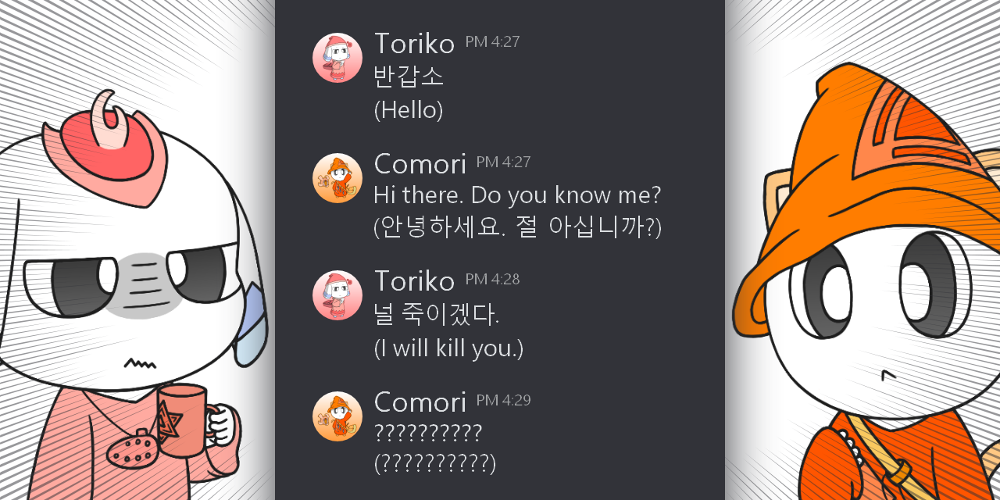
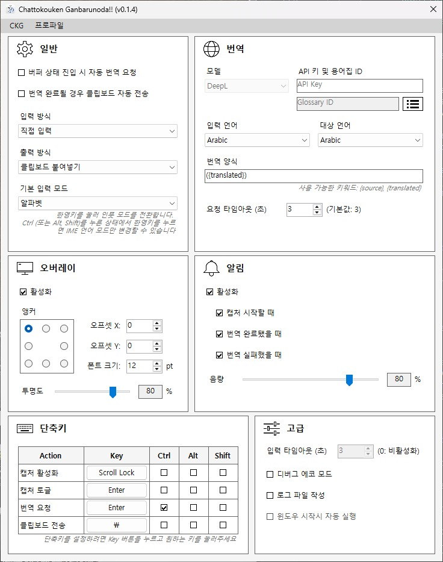

# Chattokouken Ganbarunoda!!




[English](../README.md) | [한국어](README_KR.md) | [日本語](README_JP.md)

### 채팅 공헌 힘내는 것이다!!

> 실시간 채팅 번역 및 전송을 해주는 자동 번역 보조 툴인 것이다! 딱히 개발자 용도는 아닌 것이다!

---

<br>

## 목차인 것이다!

- [주의 및 제한 사항인 것이다!](#warning)
- [미리보기인 것이다!](#preview)
- [뭐하는 프로그램인 것이다?](#about)
- [설치 및 사용 방법인 것이다!](#install)
- [설정하는 방법인 것이다!](#setting)
- [변경 사항 및 업데이트 예정인 것이다!](#changelog)
- [개발자를 지원해줄 수 있는 것이다!](#support)
- [자주 묻는 질문인 것이다!](#faq)
- [지루하고 현학적인 기술 설명](#description)

<br>
<a id="warning"></a>

## ⚠️ 주의 및 제한 사항인 것이다!

> 이 프로그램은 매크로와 같은 키 입력 감시 및 프로세스 포커스 이동 등을 사용하고 있으니, 깐깐한 안티 치트나 매크로 방지가 있는 게임 등에서는 사용하지 않는 걸 권장하는 것이다! 해당 프로그램 사용으로 인한 계정 정지나 밴은 개발자가 책임져 줄 수 없는 것이다!

> 프로그램 구조상 지금은 알파벳과 한글만 입력받을 수 있는 것이다.. 추후에 별도의 방식으로 모든 언어를 지원할 수 있는 수단을 개발할 예정이니 기다려달라는 것이다! 번역 대상 언어는 상관없는 것이다!

<br>
<a id="preview"></a>

## 🎬 미리보기인 것이다!

> 대화 상대는 내 친구인 것이다. 무례한 게 아닌 것이다.


<br>
<a id="about"></a>

## ✨ 뭐하는 프로그램인 것이다?

> 게임이나 메신저에서 채팅을 할 때 번역이 필요하면 \>\>*채팅을 입력하고 복사하고 웹 번역기로 가서 번역하고 복사하고 돌아와서 붙여놓고 다시 전송*\<\< 해야하는 매우 매우 큰 불편함이 있는 것이다.. <br>그런 불편함을 없애고 채팅 입력 주기에 맞춰 번역을 요청하고 번역문을 받으면 자동으로 입력을 시켜주는 유저 경험을 최대화 해주는 프로그램인 것이다! 그래서 자동! 채팅! 번역! 보조! 툴!

<br>

다음과 같은 기능이 있는 것이다:

- 키를 입력하면 열심히 문자를 조립하고 저장해주는 컴포저
- 요청만 하면 불만 없이 번역을 해서 돌려주는 DeepL 과의 연동
- 번역된 문장을 클립보드에 넣어주는 친절함
- 나 대신 클립보드 내용을 입력해주는 매크로
- 프로그램 상태를 보여주는 직관적이고 믿음이 가는 오버레이
- 프로그램 상태를 알려주는 울려퍼지는 아름다운 알림 효과음
- 가벼운 시스템 트레이!

<br>

이 프로그램은 게임이나 메신저의 채팅을 읽거나 가로채는 프로그램이 아닌 것이다. 그건 문제가 아주 많은 것이다. 그것과는 별개로 키 입력을 받아서 문장을 조립하는 것이다.

<br>
<a id="install"></a>

## 📦 설치 및 사용 방법인 것이다!

> Windows 11 64bit 환경에서만 사용 가능한 것이다! Windows 10 은 테스트 해보지 않은 것이다.

<br>

[Releases](https://github.com/Railiya/ChattokoukenGanbarunoda/releases) 에서 가장 최신 압축 파일을 받고 CKG.exe 를 실행하는 것이다. 관리자 권한이 필요한 것이다!

<br>

프로그램의 생명주기는 다음과 같은 것이다:

1. **[DISABLED]** : 프로그램의 키 입력이 꺼져있는 상태인 것이다. "Enable Capturing" 키로 켜거나 다시 끌 수 있는 것이다!
2. **[IDLE]** : 대기중인 상태인 것이다.
3. **[CAPTURING]** : 입력을 받고있는 중인 것이다. "Capturing Toggle" 키로 전환할 수 있는 것이다!
4. **[BUFFERED]** : 입력이 완료되고 문장이 저장된 상태인 것이다.
5. **\>\> TRANSLATING** : 번역 요청을 보내고 기다리는 중인 것이다! "Translate" 키로 요청을 보내는 것이다!
6. **[READY]** : 번역이 끝나서 클립보드에 복사된 것이다! "Send Clipboard" 키로 입력 매크로를 실행할 수 있는 것이다!
7. **[FAILED]** : 번역 요청이 실패한 것이다.. 이유는 여럿 있으니 로그 파일을 봐야하는 것이다.

<br>

실제 채팅을 할 때는 이 순서로 진행되는 것이다: (키는 기본값 기준인 것이다)

1. **채팅 입력 시작 (Enter)** *[Idle -> Capturing]*
2. 텍스트 입력
3. **채팅 입력 완료 (Enter)** *[Capturing -> Buffered]*
4. **번역 요청 및 대기 (Ctrl + Enter)** *[Buffered -> Translating]*
5. 번역 완료 *[Translating -> Ready]*
6. **입력 매크로 실행 (Backslash)**

<br>

**(매우 중요한 내용인 것이다)**

이 프로그램은 한/영 입력 상태가 윈도우 IME와는 별도로 존재하는 것이다. 프로그램의 구조상 현재 입력중인 언어를 알 수 없다는 것이다. 그러니 **프로그램 내 한/영 입력 모드는 수동으로 전환해야하는 것이다. 한/영 키를 누르면 프로그램의 입력 모드도 윈도우 IME와 같이 자동으로 변경되지만, Ctrl, Alt, Shift 셋 중 아무거나 누른 상태로 한/영 키를 누르면 프로그램의 입력 모드는 변경되지 않는 것이다.** 이 방법으로 채팅의 입력 언어와 프로그램 입력 언어를 맞춰두고 쓰는 것이다.

<br>

4번과 6번 과정은 옵션을 설정하면 자동으로 진행시킬 수 있는 것이다! 두 옵션을 모두 켜면 다른 키 누를 필요 없이 채팅만 하면 되는 것이다! 이 과정은 어느정도 익숙해질 필요가 있으니 "Advanced - Debug Echo Mode" 를 켜고 메모장에서 연습해보는 걸 추천하는 것이다!

<br>

프로그램에서 X 버튼을 누르면 꺼지지 않고 시스템 트레이 상태가 되는 것이다. 프로그램은 계속 작동한다는 것이다. 프로그램을 종료하려면 상단 메뉴에서 "CKG -> Exit" 를 누르거나 시스템 트레이 아이콘을 우클릭해서 "Exit" 를 누르면 된다는 것이다.

<br>
<a id="setting"></a>

## ⚙️ 설정하는 방법인 것이다!



### 일반 (General)

> 자동 옵션을 모두 켜면 UX가 크게 개선되지만 번역이 오래 걸리거나 Timeout 되면 그 동안 아무것도 못하니 주의하는 것이다!

| Setting | Description |
|---|---|
| 버퍼 상태 진입 시 자동 번역 요청 | 입력이 완료되고 버퍼 상태가 되면 자동으로 번역 요청을 보내는 것이다 |
| 번역 완료 시 클립보드 자동 전송 | 번역이 완료되면 자동으로 입력 매크로를 시작하는 것이다 |
| 입력 방식 | 채팅 원문을 입력하는 방식안 것이다 |
| 출력 방식 | 입력 매크로의 작동 방식인 것이다 |
| 기본 입력 모드 | 프로그램의 최초 한/영 상태인 것이다 |

- 입력 방식 - 직접 입력 : 게임 또는 메신저의 채팅에 입력하는것이다. 키 입력을 통해 글자를 조합하는 것이다.
- 입력 방식 - 오버레이 입력 : 프로그램의 인풋 필드에 입력하는 것이다. 직접 입력을 지원하지 않는 언어에서 사용하는 것이다.
- 출력 방식 - 클립보드 붙여넣기 : 클립보드 내용을 붙여넣는 방식인 것이다.
- 출력 방식 - 입력 시뮬레이션 : 클립보드 내용을 한 글자씩 입력하는 방식인 것이다. (붙여넣기가 되지 않는 게임에서 쓰는 것이다)

<br>

### 번역 (Translation)

> 번역을 사용하기 위해서는 DeepL API 키를 발급해야하는 것이다! 아직 다른 번역기 모델은 지원하지 않는 것이다. 용어집은 고유 명사같은 것들을 미리 등록해서 이상하게 번역되지 않게 하기 위한 사용자 정의 사전인 것이다! 용어집 ID는 등록하지 않아도 괜찮은 것이다.

| Setting | Description |
|---|---|
| 모델 | 사용할 번역기의 모델인 것이다 |
| API 키 | 번역기에 필요한 인증 키인 것이다 |
| 용어집 ID | 용어집의 id인 것이다 |
| 입력 언어 | 입력되는 언어인 것이다 |
| 대상 언어 | 번역될 언어인 것이다 |
| 번역 양식 | 번역된 문장이 클립보드에 복사되는 형식인 것이다 |
| 요청 타임아웃 | 번역을 요청하고 시간이 지나면 취소되는 것이다 |

<br>

### 오버레이 (Overlay)

> 프로그램의 현재 상태가 보이는 것이다. 상태에 따라 텍스트 색상도 바뀌는 것이다! 우측에는 프로그램의 입력 모드가 표시되는 것이다! 알파벳이면 'A' 한글이면 '가'로 표시되는 것이다!

| Setting | Description |
|---|---|
| 활성화 | 오버레이를 켜거나 끄는 것이다 |
| 앵커 | 오버레이가 표시되는 스크린의 기준점인 것이다 |
| 오프셋 X,Y | 기준점으로 부터의 위치인 것이다 |
| 폰트 크기 | 폰트 크기인 것이다 |
| 투명도 | 투명도인 것이다 |

<br>

### 알림 (Notification)

> 사운드 파일들은 Sounds 폴더 내에 있는 것이다. 이름만 같다면 다른걸로 바꿀 수 있는 것이다!

| Setting | Description |
|---|---|
| 활성화 | 소리 알림을 켜거나 끄는 것이다 |
| 캡처 시작할 때 | 입력이 시작될 때 알림을 주는 것이다 |
| 번역 완료됐을 때 | 번역이 완료됐을 때 알림을 주는 것이다 |
| 번역 실패했을 때 | 문제가 생겨 번역이 실패했을 때 알림을 주는 것이다 |
| 음량 | 알림의 음량인 것이다 |

<br>

### 단축키 (Hotkeys)

> 키를 변경하려면 버튼을 눌러 버튼의 텍스트가 "..." 이 되었을 때 원하는 키를 눌러 바꾸는 것이다. ESC를 누르면 할당 취소할 수 있는 것이다. 제어 문자로 구분되기 때문에 키가 겹쳐도 문제 없는 것이다. 하지만 게임에서 사용할 때는 게임의 키와 겹치지 않게 주의하는 것이다.

| Setting | Description |
|---|---|
| 캡처 활성화 | 프로그램의 키 입력을 상태를 켜거나 끄는 것이다 |
| 캡처 토글 | 입력 시작과 끝인 것이다 (게임에서 쓴다면 채팅 단축키에 맞추는 것이다) |
| 번역 요청 | 번역 요청을 보내는 것이다 |
| 클립보드 전송 | 클립보드 내용 입력 매크로를 실행하는 것이다 |

<br>

### 고급 (Advanced)

> 주로 디버깅할 때 쓰는 것이다. 로그는 Logs 폴더에 저장되는 것이다.

| Setting | Description |
|---|---|
| 디버그 에코 모드 | 번역 요청을 보내지 않고 원문을 클립보드에 복사하는 것이다 |
| 로그 파일 작성 | 상태가 변경될 때 마다 로그를 쓰는 것이다 |

<br>
<a id="changelog"></a>

## 📄 변경 사항 및 업데이트 예정인 것이다!

변경 사항은 [CHANGELOG.md](../CHANGELOG.md) 파일을 참고하는 것이다! 아쉽게도 일본어는 없는 것이다..

<br>

### 다음에 추가될지도 몰라: (인 것이다!)

> 이 프로젝트는 개인적으로 시간날 때 업데이트하는 것이다. 반드시 추가된다고 약속할 수는 없는 것이다. 그리고 시간도.

<br>

**오버레이 인풋 방식**

지금 방식으로는 중국어나 일본어의 한자 처럼 복잡한 것을 쓸 수 없는 문제가 있는 것이다. 이런 근본적인 제약을 해결하기 위해 오버레이에 인풋 필드를 만들고 입력이 시작되면 강제로 포커스를 옮겨 오버레이에서 윈도우 IME 를 통해 입력하고 입력이 끝나면 원래 프로세스로 포커싱을 옮겨 원문 부터 입력시킨 뒤 이후는 하던대로 번역 요청 부터 입력 매크로 실행까지 진행하는 것이다. 하지만 이 방식은 여러 제약이 있어서 입력 문제가 있는 언어에서만 사용되는 보조 수단이 되는 것이다.

<br>

**OCR 번역**

프로그램 취지와는 별개로 추가할 예정인 것이다. 이것 또한 인풋이 제대로 되지 않을 때 보조 수단으로는 사용할 수 있는 것이다. 다른 사람의 채팅을 번역할 수도 있다는 장점도 있는 것이다.

<br>

**입력 매크로 설정**

지금은 게임에 초점이 맞춰져 있어서 입력 매크로가 "Enter -> 입력 -> Enter" 식으로만 동작하는 것이다. 메신저에서는 항상 인풋이 활성화되어 있는 상태이니 앞서 Enter를 칠 필요가 없는 것이다. 이걸 고려해서 설정을 조금 추가할 생각인 것이다.

<br>

**프로파일 리스트**

게임이나 메신저별로 설정을 여러개 할 수 있도록 좌측에 사이드 메뉴로 프로파일 리스트를 추가하는 것이다.

<br>

**더 많은 번역기 API**

구글 번역 API 나 파파고 번역 API를 생각중인 것이다. 하지만 파파고 번역은 유료 모델만 지원해서 솔직히 조금 힘든 것이다.

<br>

**WinForm 에서 Avalonia 로 프레임워크 이전**

WinForm은 윈도우에서만 동작하는 제약이 있는 것이다.. 그리고 예쁘지 않은 것이다.. 그래서 추후 맥이나 리눅스를 지원할 여지가 있고 좀 더 세련된 외관을 가진 Avalonia 로 이전할 의향도 있는 것이다! 물론 그 전에 다른 플랫폼에서도 정상적으로 키 입력이나 다른 기능들이 동작하는지는 알아봐야하는 것이다.

<br>
<a id="support"></a>

## ☕ 개발자를 지원해줄 수 있는 것이다!

> 프로젝트가 마음에 든다면 개발자를 지원해줄 수 있는 것이다! 강요는 아닌 것이다!

<br>

[Ko-fi](https://ko-fi.com/glingy) 또는 [Sponsors](https://github.com/sponsors/Railiya) 에서 지원해줄 수 있는 것이다! 해주면 고마운 것이다!

<br>
<a id="faq"></a>

## ❓ 자주 묻는 질문인 것이다!

**Q. 왜 이런 말투를 쓰는 것이지?**

> **A. 그야.. 재미있으니까.**

<br>

**Q. 키 입력을 받을 때 마우스나 방향키 관련된 입력은 받을 수 없는가?**

> **A. 이 프로그램은 키 입력만을 받기 때문에 마우스 관련된 이벤트가 발생하면 처리할 수 없다. 다만 방향키 관련된 것은 일부러 만들지 않았다. 채팅할 때 잘 쓰이지 않기 때문. 백스페이스는 문제 없으니 경험적으로 큰 문제는 없다. 하지만 요구하는 사람이 많다면 방향키 이벤트는 구현해보겠다.**

<br>

**Q. 아이콘이 왜 이 꼬라지인 것이지?**

> **A. 아이콘 좀 그려주십쇼..**

<br>
<a id="description"></a>

## 🛠️ 지루하고 현학적인 기술 설명

<br>

### 작동 원리

윈도우 전역에서 사용되는 키 입력에 Hook을 걸고 로우 레벨 단계에서 키 입력을 추적하는데, 안타깝게도 이 입력은 문자가 아닌 키로 받는다. 따라서 'a' 키를 눌렀다면 그것이 'a' 일수도 'A' 일수도 'ㅁ' 일수도 있다. 그렇기 때문에 현재 입력 모드에 따라 알파벳이나 한글을 조합하는 컴포저를 구현해서 입력된 문장을 재조립하는 방법을 쓴다. 이 때문에 일본어에서 쓰는 한자는 입력받을 수 없다. 한자를 입력할 때 사용되는 한자 목록이 플랫폼마다 다르고 사용자가 자주 쓰는 한자에 따라 달라서 이걸 추적할 방법이 없다.. 

마우스 이벤트를 받을 수 없는 것도 문제 중 하나인데, 순수하게 키 입력만 받기 때문에 마우스로 커서를 움직인다던가 한자를 마우스로 선택한다던가 하면 추적할 방도가 없다.

<br>

### 안정성

상단 주의 사항에도 써뒀지만 이 프로그램의 작동 방식은 매크로와 같아서 안티 치트가 있는 게임에서 사용하면 위험할 수 있다. 프로그램의 사용에 대한 책임은 늘 사용자에게 있음을 알려주고 싶다. 혹시 모르니 이 프로그램에서 사용된 Win32 함수들을 작성해두겠다:

```cs
extern void keybd_event(byte bVk, byte bScan, uint dwFlags, nuint dwExtraInfo);
extern uint SendInput(uint nInputs, INPUT[] pInputs, int cbSize);
extern bool BlockInput(bool fBlockIt);

extern nint SetWindowsHookEx(int idHook, HookProc lpfn, nint hMod, uint dwThreadId);
extern bool UnhookWindowsHookEx(nint hhk);
extern nint CallNextHookEx(nint hhk, int nCode, nint wParam, nint lParam);
extern nint GetModuleHandle(string lpModuleName);

extern short GetKeyState(int nVirtKey);
extern short GetAsyncKeyState(int vKey);
extern bool GetKeyboardState(byte[] lpKeyState);
extern nint GetKeyboardLayout(uint idThread);
```
